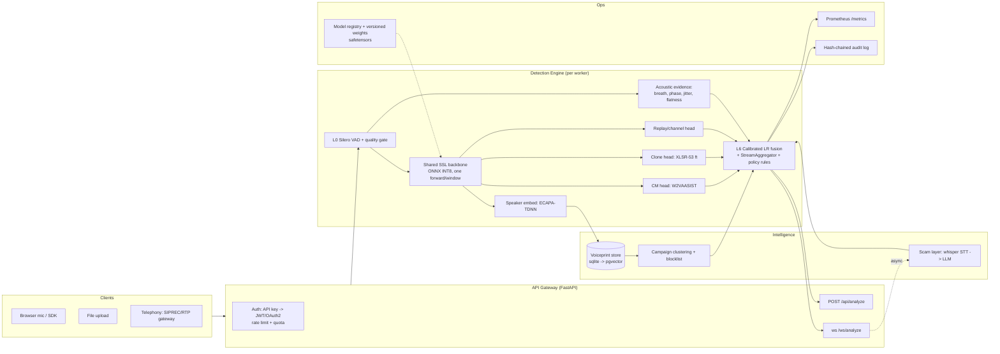

# Dhwani-Kavach Platform Blueprint (V3)

> **🔭 FORWARD-LOOKING VISION — not shipped state.** This is the *target*
> architecture and a menu of future upgrades (ONNX/INT8, WavLM, FAISS/pgvector,
> continual-learning loop, etc.). It describes where the platform could go, **not
> what runs today.** For the deployed system and measured numbers, see
> [FINALS-DECK-BRIEF.md](FINALS-DECK-BRIEF.md) (canonical) and
> [TECHNICAL-OVERVIEW.md](TECHNICAL-OVERVIEW.md). Don't quote anything here as a
> current capability on a slide.

**A complete technical audit and target architecture for evolving Dhwani-Kavach from a
deepfake detector into an enterprise Voice Intelligence Platform.**

Date: 2026-07-12 · Scope: full stack (ML, backend, streaming, frontend, deployment, security)

> **Status update (2026-07-21):** this document is the *forward-looking target
> architecture* — read it for direction, not current state (that's
> [HANDOFF.md](HANDOFF.md)). Since it was written: **all 8 §16 "Must have (P0)"
> items are done** — WS auth, Silero VAD gate, batched inference, `model_version`
> in every verdict, safetensors (the `torch.load` RCE vector removed),
> `LiveMonitor` wired to the WS, `sota_detector.py`/`pyaudio` cleanup, fixed
> compose — with one substitution: §9's ONNX INT8 recommendation was tried and
> measured **slower on CPU** than backbone truncation (quantization overhead
> dominates on CPU; ONNX INT8 remains the right call only with a GPU target),
> so truncation shipped instead. Of §16 "Should have (MVP)": L6 learned fusion
> exists (opt-in, not yet default), an eval harness with a channel-robust A/B
> grid is built (`backend/eval/`), and — direct validation of this doc's own
> §2.3 thesis that "generalization is the known failure mode" — a public
> SOTA checkpoint (XLSR-SLS, §4 candidate) was ported and A/B'd against the
> deployed model and **lost on 4/5 real-world channels**, confirming §2.3's
> point empirically rather than just citing it. Per-channel calibration,
> Postgres/pgvector, and the timeline/evidence UI are still open.

---

## 0. Executive summary — the verdicts

1. **The core detection philosophy is already correct and should be kept.** Two
   independent neural detectors + disagreement-as-novelty + EWMA/hysteresis streaming
   aggregation + Platt calibration + rule-based action fusion is exactly the pattern
   commercial systems (Pindrop, ValidSoft) and ASVspoof winners converge on. Do not
   rewrite this. The problems are around it, not in it.
2. **The single biggest engineering flaw is running two ~1.2 GB SSL backbones per 4-second
   window.** `detector_v2` (XLS-R-300M) and `detector_v3` (XLSR-53-large) each run a full
   wav2vec2 forward pass on every window, on CPU, serially. This dominates latency, RAM,
   and cost. Fix: one shared backbone, multiple heads, exported to ONNX INT8.
3. **The four handcrafted heuristics carry 50 % of the verdict but zero validation.**
   Hand-set thresholds on MFCC std / spectral flatness / pitch jitter will misfire on
   telephony audio (band-limited 300–3400 Hz changes every one of those statistics).
   Demote them from *voters* to *evidence* (explainability + quality gates); let a small
   trained fusion layer own the verdict.
4. **AASIST should stay — but as a head, not a model.** `W2VAASIST` (SSL front-end +
   AASIST graph back-end) *is* the current published SOTA pattern; you already run it.
   The raw-audio `AASIST.pth` fallback tier is dead weight from 2021: delete it.
5. **Security has real holes for a product handling biometric data:** the WebSocket
   endpoint bypasses the API-key guard entirely; `torch.load(weights_only=False)` +
   the `sys.modules["model"]` alias is an arbitrary-code-execution vector if a checkpoint
   is ever swapped; CORS defaults to `*`; no rate limiting anywhere.
6. **The moat is the voiceprint/campaign layer, not the classifier.** Cross-call voice
   clustering + blocklist ("this synthetic voice already hit 3 other customers") is what
   Pindrop actually sells. Invest there; classifiers commoditize, network data doesn't.
7. **Don't build the enterprise skeleton yet.** Kubernetes, Triton, feature stores, model
   registries-as-a-service are pilot/enterprise-stage items. The roadmap (§15) stages
   them. Building them now would be pure drag on a team of this size.

---

## 1. Phase 1 — Current-state audit

### 1.1 What exists (verified by reading every backend file)

```
Ingest      : POST /api/analyze (upload, 25 MB cap) · ws /ws/analyze (raw f32 PCM frames)
Decode      : soundfile → librosa → bundled ffmpeg (3-tier fallback; covers everything)
Windowing   : 4 s windows, 2 s hop, ≤16 chunks strided per file, RMS silence gate
Detectors   : detector_v2 (XLS-R-300M + W2VAASIST head, Codecfake-trained)
              detector_v3 (XLSR-53-large fine-tuned on ElevenLabs/Polly/etc.)
              wav2vec2_detector (older fine-tune, gitignored weights) → CNN → AASIST fallbacks
Heuristics  : MFCC/spectral, breath, phase-coherence, liveness (50 % of ensemble weight)
Fusion      : fixed hand weights → risk 0-100 → Platt calibrate → GREEN/AMBER/RED
Streaming   : StreamAggregator (EWMA α=0.35, 2-window confirm, hysteresis) — solid
Scam layer  : faster-whisper STT → NVIDIA NIM LLM → tactic tags (async, non-blocking)
Action      : rule-based MONITOR/CHALLENGE/BLOCK with txn context — auditable
Intelligence: sqlite voiceprint store, cosine clustering, campaign/blocklist
Ops         : /metrics endpoint, audit log, shadow mode, model_registry.json (unwired)
Frontend    : TanStack Start + React + shadcn; upload UI only (WS built but unwired)
Deploy      : docker-compose (stale/dev-mode), single Dockerfile, start-demo.bat
```

### 1.2 Keep / Fix / Kill

| Component | Verdict | Why |
|---|---|---|
| `StreamAggregator` (EWMA+confirm+hysteresis) | **KEEP** | Textbook streaming decision smoothing; earliest RED ~6 s, inside the 10 s budget |
| Platt calibration + clamped `calibration.json` | **KEEP** | Right mechanism; extend to per-channel (§10) |
| Two-detector disagreement → novelty | **KEEP** | Deep-ensembles OOD signal; better than single-model confidence |
| Ensemble weight-redistribution for missing layers | **KEEP** | Correctly avoids "missing = confident real" bias |
| Rule-based `fuse()` action policy | **KEEP** | Banks audit decisions; rules explain themselves |
| Voiceprint campaign store | **KEEP + INVEST** | The actual moat (§1.5, §7 L5) |
| `telephony.py` augmentation | **KEEP** | Correct G.711/band-limit simulation; central to training |
| 3-tier audio decode fallback | **KEEP** | Covers WhatsApp/M4A/video containers cheaply |
| Dual full SSL backbones per window | **FIX (P0)** | 2× ~300 M-param forward passes per 4 s window on CPU; §4 |
| Heuristics at 50 % ensemble weight | **FIX (P0)** | Unvalidated thresholds voting on verdicts; demote to evidence (§6) |
| WS endpoint unauthenticated | **FIX (P0)** | `_guard` covers `/api/*` routers only; `ws_router` mounted without it |
| `torch.load(weights_only=False)` + module alias | **FIX (P1)** | Checkpoint = RCE vector; convert to safetensors state-dict |
| No VAD before inference | **FIX (P1)** | RMS gate ≠ speech detection; room noise burns full SSL passes |
| Serial per-chunk inference on upload | **FIX (P1)** | Chunks are independent → batch them; free 3-5× throughput |
| No model version in API responses | **FIX (P1)** | `model_registry.json` exists but inference never reports which model/tier produced a verdict — silently variable accuracy |
| docker-compose | **FIX (P2)** | Dev-mode mounts, `NEXT_PUBLIC_API_URL` (Next.js var for a Vite app), port 3000 vs actual 8080 |
| `sota_detector.py` | **KILL** | Dead experiment: unimported, duplicates detector.py structure, hardcodes another HF model |
| Raw `AASIST.pth` fallback tier | **KILL (eventually)** | 2021-era raw-audio model; never wins; delete once CNN fallback confirmed sufficient |
| `pyaudio` in server requirements | **KILL** | Mic capture is a client concern; drags portaudio into every server image |

### 1.3 Bottlenecks & latency, quantified

Per 4 s WS window today (CPU): XLS-R-300M forward (~0.5–1.5 s) + XLSR-53-large forward
(~0.5–1.5 s) + 4 librosa heuristics (~0.1 s) ≈ **1–3 s per 2 s hop** — marginal on a good
CPU, over budget on a weak one; the "score only newest window, drop backlog" guard is what
keeps it alive. RAM: up to three resident wav2vec2 models ≈ 4–5 GB. The upload path pays
the same serially × up to 16 chunks.

### 1.4 Technical-debt register (from `ponytail:` markers + audit)

| Debt | Location | Ceiling | Upgrade path |
|---|---|---|---|
| Linear voiceprint scan | `app/voiceprints.py` | ~100 k prints | FAISS / pgvector |
| Global sqlite lock | `app/voiceprints.py` | single writer | Postgres at pilot |
| KMP_DUPLICATE_LIB_OK env hack | `app/main.py` | numeric risk (Windows) | subprocess-isolate STT |
| 16-chunk stride cap | `ml/detector.py` | long files under-sampled | batch inference removes need |
| Whisper "base" + 8 s LLM timeout | `ml/scam_detector.py` | transcript quality | larger model when GPU exists |
| Hand-set `_SIM=0.85` voiceprint threshold | `app/voiceprints.py` | unknown FA/FR | calibrate on PoC data |
| In-process metrics/audit | `app/metrics.py`, `audit.py` | single process | Prometheus + append-only store |

---

## 2. Phase 2 — What state-of-the-art systems actually do

Recurring patterns across Pindrop, ValidSoft, Reality Defender, Resemble Detect, and
ASVspoof-winning systems (no proprietary implementations copied — these are the
published/observable architectural patterns):

1. **Multi-signal, not multi-model-of-the-same-signal.** Commercial platforms fuse
   *different information sources*: synthetic-speech detection + speaker verification +
   channel/device fingerprinting + behavioral/metadata risk + cross-customer intelligence.
   Pindrop's "Phoneprinting" is channel-artifact analysis (codec, packet, device traces),
   not deepfake detection at all. Your scam layer + voiceprint layer already point this
   direction; §7 formalizes it.
2. **SSL front-end + lightweight discriminative back-end is the ASVspoof consensus.**
   wav2vec2-XLS-R or WavLM features + AASIST/graph-attention or simple pooling heads win
   ASVspoof 2021/5 tracks. You already run this (W2VAASIST). Raw spectral models (LCNN,
   RawNet2) survive only as *diversity* members in fusions.
3. **Generalization is the known failure mode.** Müller et al. (Interspeech 2022) showed
   200–1000 % EER degradation out-of-domain; ASVspoof 5 (2024) added crowdsourced +
   adversarial + codec conditions specifically because detectors overfit known
   generators. Consequences the winners draw: heavy augmentation (RawBoost, codecs,
   noise), training across *many* generator families, one-class/metric objectives, and
   score fusion of diverse subsystems. Never trust one detector; never evaluate only
   in-domain (§13).
4. **Score-level fusion with learned, calibrated weights.** Winning submissions fuse
   subsystem scores via logistic regression / linear calibration on a dev set — simple,
   auditable, and it beats hand weights. (§7 L6 replaces your hand weights with exactly
   this.)
5. **Streaming = windowed scoring + temporal decision smoothing.** Nobody runs one model
   on a whole call; everyone scores rolling windows, aggregates with smoothing +
   hysteresis, and emits continuously updated risk. You already do this correctly.
6. **New threat classes get their own detectors, not bigger binary classifiers:**
   partial spoofs (PartialSpoof), neural-codec/ALM fakes (Codecfake — you already train
   on it), replay (ASVspoof PA), and audio watermark/provenance checks (AudioSeal, C2PA)
   as complementary signals.
7. **Privacy-by-design voiceprints.** Store embeddings, not audio; irreversibility and
   deletion rights are sales requirements in banking (GDPR / India DPDP Act 2023).

---

## 3. Phase 3 — Target architecture

### 3.1 System diagram



### 3.2 Component decisions (with trade-offs)

| Layer | Decision | Why / trade-off |
|---|---|---|
| API framework | **Keep FastAPI** | Already correct; async WS + threadpool offload already done right |
| Streaming ingest | **Keep raw-PCM WebSocket now; add WebRTC (aiortc/LiveKit) at pilot; SIPREC/RTP gateway at enterprise** | WS covers browser + SDK; WebRTC only matters when NAT/jitter/echo become real; telephony ingest is a business-deal-driven feature |
| Queue/broker | **None now → Redis Streams at pilot** | One process handles a demo; Redis is already in compose; NATS/Kafka only at multi-node scale |
| Inference runtime | **ONNX Runtime INT8 (CPU), CUDA EP when GPU exists** | §9; biggest latency lever available |
| Model server | **In-process now → Triton at enterprise** | Triton's dynamic batching pays off only with many concurrent streams + GPU |
| Feature store | **Don't build one** | Features are computed per-window from live audio; there is nothing to store. The voiceprint DB is the only persistent feature store needed |
| Model registry | **Wire the existing `model_registry.json` into responses now; MLflow at pilot** | The file exists; inference must report `model_version` per verdict |
| Auth | API key → per-tenant keys + JWT (pilot) → OAuth2/mTLS (enterprise) | Staged; §12 |
| DB | sqlite → **Postgres + pgvector** at pilot | One migration, replaces voiceprints + audit + cases |
| Cache | None needed | Verdicts aren't cacheable (unique audio); HF model cache already handles weights |
| Frontend | **Keep** TanStack/React/shadcn; wire the existing WS into `LiveMonitor` | The streaming backend is built and unused — that's a frontend wiring task, not an architecture task |
| SDK | Thin WS client libs (JS first, then Python) at pilot | The protocol is already trivial: f32 PCM frames in, JSON verdicts out |

---

## 4. Phase 4 — Model selection

### 4.1 Comparison (for this product: streaming CM on telephony-grade audio, CPU-first)

| Model | EER (ASVspoof21 LA, typ.) | Generalization | CPU latency /4 s | Verdict |
|---|---|---|---|---|
| AASIST (raw audio, 2021) | ~1–4 % in-domain | Poor OOD (Müller '22) | fast (~300 k params) | Kill as standalone; keep the *graph back-end* idea |
| RawNet2/3 | similar | poor–fair | fast | Only as a cheap diversity member; your CNN already fills this slot |
| **wav2vec2 XLS-R + AASIST head (= your W2VAASIST)** | ~0.8–2 % | **best published class** | heavy (backbone) | **KEEP as primary CM head** |
| WavLM-base+ + head | comparable, often better | best class | heavy | Best backbone *if retraining from scratch*; not worth abandoning two working XLS-R checkpoints for now — revisit at first full retrain |
| Whisper encoder + head | fair | fair | heavy | No; trained for ASR, weaker anti-spoof features |
| HuBERT + head | good | good | heavy | No advantage over XLS-R here |
| ECAPA-TDNN / CAM++ | n/a (speaker verif.) | n/a | **fast (~6 M params)** | **ADD for speaker-consistency layer (L4/L5)** — not a CM |
| MFA-Conformer | n/a (speaker verif.) | n/a | medium | ECAPA is cheaper and sufficient |
| AST / ViT-spectrogram | fair | fair | medium | Image-transformer detectors underperform SSL audio features on spoofing |
| CNN-LSTM hybrids | dated | poor | fast | No |
| GNN approaches | = AASIST family | — | — | Already covered by the AASIST head |

### 4.2 The chosen ensemble

**One shared SSL backbone, many heads** — this is the single most important change:

```
audio window (4 s, 16 kHz, VAD-gated)
   └─> XLS-R-300M ONNX INT8  (ONE forward pass, hidden states cached)
         ├─> CM head:      W2VAASIST (existing checkpoint, layer-5 features)   → p_spoof_codec
         ├─> Clone head:   small MLP distilled from detector_v3 on layer-k     → p_spoof_clone
         ├─> Replay head:  trained on ASVspoof PA (future)                     → p_replay
         └─> Embed head:   pooled features → voiceprint                        → 160-d vector
   plus (cheap, parallel):
         ├─> ECAPA-TDNN (6 M params) → speaker embedding per window            → within-call drift
         └─> spectral CNN (existing deepfake_cnn.pt) → diversity vote          → p_spoof_spectral
```

**Why:** detector_v2 and detector_v3 currently pay for two ~1.2 GB backbones to get two
opinions. Different *heads* on one backbone + one architecturally-different cheap model
(your existing CNN) preserves the ensemble-diversity insight at less than half the compute.
The migration path is incremental: step 1 shares nothing but exports detector_v2 to ONNX
(immediate ~2–4× speedup); step 2 distills detector_v3's knowledge into a head on the
shared backbone (needs a training run; keep detector_v3 as teacher until the student
matches it on the devkit).

- Expected accuracy: neutral-to-positive (distillation typically costs <0.5 % EER; ONNX
  INT8 costs ~0.1–0.3 % EER; freed compute buys a replay head and ECAPA, which add whole
  new detection classes).
- Latency: ~1–3 s/window → **~150–400 ms/window** on CPU (INT8 + single backbone).
- RAM: ~4–5 GB → ~1.5 GB.
- Complexity: medium (one distillation training run + ONNX export scripts).

---

## 5. Phase 5 — Dataset strategy

### 5.1 Training / eval matrix

| Role | Dataset | Notes |
|---|---|---|
| Core CM training | **ASVspoof 2019 LA, ASVspoof 2021 LA+DF, ASVspoof 5 (2024)** | ASVspoof 5 adds crowdsourced acoustic conditions + adversarial attacks — highest priority addition |
| Neural-codec fakes | **Codecfake** (already used) | Covers VALL-E-style ALM fakes; keep |
| Modern commercial TTS | **In-house clone pack** (already: ElevenLabs; extend to PlayHT, OpenAI TTS, Cartesia, Fish-Audio, Parler) | Automate: §5.2 |
| Vocoder fakes | **WaveFake**, DFADD | Vocoder-family coverage |
| Multi-language fakes | **MLAAD** (Multi-Language Audio Anti-Spoofing, 30+ languages) | Critical for Hindi/Indic robustness — the biggest gap in current training data |
| Partial spoofs | **PartialSpoof** | Spliced real+fake utterances — attack you currently can't represent |
| Replay | **ASVspoof 2019/2021 PA** | Enables the replay head (L3) |
| Speaker verif. | **VoxCeleb 1/2** | ECAPA training/eval (or use pretrained SpeechBrain ECAPA — recommended) |
| Real speech (bona fide) | LibriSpeech, VCTK, **Common Voice (hi/ta/te/bn/mr)** (already using hi) | Indic bona fide balance |
| **Eval-only, never train** | **In-the-Wild** | The standard generalization benchmark; training on it destroys its value — note: `model_registry.json` says v3/v4 trained on ITW → **stop; retrain without it and hold it out** |
| Noise/channel aug | **MUSAN**, **OpenSLR RIRs**, your `telephony.py`, RawBoost | Applied on-the-fly at training |
| Codec aug | G.711 (have), AMR-NB, Opus, MP3/AAC re-encode | Per-codec eval breakdown (§13) |

### 5.2 Continual data pipeline

```
new TTS engine released
  └─> tools/clone_harvest.py: 20 scripted utterances × N voices × engine API
        └─> auto-label, telephony-augment, append to devkit manifest (versioned, DVC or git-lfs)
              └─> nightly eval: champion model EER on new slice
                    └─> EER > threshold? → open retraining ticket with the slice attached
```

Plus production feedback: every CHALLENGE/BLOCK verdict with analyst disposition
(governance routes already exist) becomes a weakly-labeled training candidate —
embeddings + verdict metadata only, raw audio retained per data-retention policy (§12).

---

## 6. Phase 6 — Feature engineering

**Principle: neural features decide, handcrafted features explain and gate.**

| Feature class | Learn or extract? | Role |
|---|---|---|
| SSL representations (XLS-R/WavLM hidden states) | **Learned** | The verdict. All CM heads consume these |
| Spectrogram (mel/CQT) | Learned (CNN member) + rendered raw | Diversity vote + the explainability heatmap surface (§11) |
| LFCC/CQCC | Skip | Their discriminative content is subsumed by SSL features; they earn a place only in an ultra-cheap edge tier |
| MFCC dynamics, spectral flatness, centroid CV | Extract | **Evidence only** — human-readable artifact list, zero verdict weight |
| Breath events, pitch jitter/shimmer, syllabic AM | Extract | Evidence + liveness narrative in UI |
| Phase / group delay coherence | Extract | Evidence; genuinely useful vocoder tell, but as displayed artifact not vote |
| F0 stability, prosody contours | Extract | Evidence + within-call consistency track |
| Codec fingerprint (band edge, µ-law traces, packet-loss pattern) | Extract | **Channel profile**: routes to the right calibration file (§10) + replay/channel head input |
| Noise-floor & room consistency over time | Extract | Splice/replay cue; feeds L3 |
| Packet timing (RTP jitter) | Extract (pilot, telephony ingest only) | Pindrop-style channel intelligence — only when RTP ingest exists |
| Speaker embedding (ECAPA) | Learned | L4/L5 consistency + campaign store |

Fusion of the two worlds happens **at score level** (L6 logistic regression), not feature
level — auditable, cheap to retrain, and each subsystem stays independently testable.

---

## 7. Phase 7 — Multi-layer detection engine

```
L0 Quality & VAD      Silero VAD (~2 MB, <1 ms/frame) + SNR/clipping/bandwidth probe.
                      No speech → no verdict (prevents "silence scored as GREEN").
                      Bandwidth probe → channel profile (clean vs telephony).
L1 Channel/codec      Codec fingerprint, band edge, re-encode traces. Output: channel
                      tag + replay suspicion prior. (Heuristic now, learned head later.)
L2 Synthetic          Shared-backbone CM heads + spectral CNN (§4.2). Per-window
                      calibrated p_synthetic.
L3 Replay             PA-trained head + L1 cues (double-codec, room-in-room reverb).
                      Output: p_replay. (Pilot-stage; needs PA training run.)
L4 Liveness           Active: existing digit challenge + Whisper content verification
                      (whisper already in stack — closing the "prompt but never verify"
                      gap is a P2 task). Passive: L2+L3 already are passive liveness.
L5 Speaker            ECAPA embedding per window: (a) within-call drift → splice/handoff
   consistency        detection; (b) match vs enrolled customer voiceprint (opt-in);
                      (c) campaign store lookup → repeat-voice / blocklist hit.
L6 Decision fusion    Logistic regression over [L1..L5 calibrated scores + novelty +
                      scam score], coefficients fit on devkit, safety-clamped like
                      calibration.json. Then: StreamAggregator (unchanged) →
                      GREEN/AMBER/RED. Then: policy rules (fuse()) + txn context →
                      MONITOR/CHALLENGE/BLOCK. Every stage logged with inputs.
```

Early exit: if L2 calibrated score > 0.95 for 2 consecutive windows AND channel profile
is trusted, emit RED immediately without waiting for scam/L5 (they continue and update).
This is how sub-6-second detection stays achievable as layers are added.

---

## 8. Phase 8 — Real-time streaming engine

Keep the current skeleton (it is correct): binary f32 PCM frames → ring buffer → 4 s
window / 2 s hop → score newest window only → StreamAggregator → JSON verdict push.

Additions, in order:

1. **VAD gating (P1):** score windows only when Silero VAD says ≥50 % speech. Cuts
   compute on silence and removes the noisiest verdicts. Latency impact: negative
   (saves work). Accuracy: strictly better inputs to the model.
2. **Continuous confidence protocol:** verdict messages already stream per window; add
   `window_index`, `t_start`, `model_version`, per-layer contributions → the UI timeline
   (§11) falls out of this message shape for free.
3. **Sub-window early hop:** on a fresh call, score the first window at 2 s (repeat-pad
   to 4 s — the model was trained on repeat-padded clips, so this is in-distribution)
   so the first verdict lands at ~2 s, not 4 s. First RED then possible at ~4–6 s.
4. **WebRTC ingest (pilot):** aiortc endpoint terminating Opus → PCM → same pipeline.
   Only when a browser-SDK customer needs echo/jitter handling; raw-PCM WS is fine for
   the demo and controlled clients.
5. **Telephony ingest (enterprise):** SIPREC recorder interface or RTP forker at the
   SBC, feeding the same PCM pipeline. This is a deployment adapter, not a new engine.
6. **Multi-stream scale-out (pilot):** one process handles ~N concurrent streams where
   N ≈ cores × (hop / window_inference_time). After ONNX (§9), a 8-core box ≈ 30–80
   streams. Beyond that: stateless WS workers behind a load balancer; per-call state
   (aggregator, buffers) is already per-connection, so horizontal scaling is trivial —
   only the voiceprint store must move to Postgres first.
```
```

## 9. Phase 9 — Inference optimization (ordered by ROI)

| Step | Gain | Cost | When |
|---|---|---|---|
| 1. Export XLS-R backbone + W2VAASIST head to **ONNX, INT8 dynamic quant** | 2–4× CPU latency, RAM halves | ~2 days; validate EER delta <0.3 % on devkit | **Now** |
| 2. **Batch** upload-path chunks (stack into one ONNX call) | 3–5× upload throughput | ~½ day | **Now** |
| 3. Single shared backbone (kill second backbone via distilled head) | halves streaming compute again | training run | Next retrain |
| 4. `intra_op_num_threads` tuning + memory-arena config | 10–30 % | hours | With step 1 |
| 5. GPU path: CUDA EP / TensorRT FP16 | ~10× vs CPU | needs GPU host | Pilot (many streams) |
| 6. Dynamic batching across concurrent streams (Triton or hand-rolled) | GPU utilization | medium | Enterprise |
| 7. Distilled small student (e.g. 20–30 M param) for edge/Jetson/mobile | edge tier unlocked | full distillation project | Enterprise |
| Skip: TorchScript (superseded by ONNX here), OpenVINO (only if an Intel-specific deployment demands it) | | | |

---

## 10. Phase 10 — Risk engine

Output taxonomy (extends current schema; additive, non-breaking):

```json
{
  "verdict": "HUMAN | SYNTHETIC | REPLAY | VOICE_CONVERSION | UNCERTAIN",
  "risk_score": 0-100,            // calibrated, channel-aware
  "risk_band": "GREEN|AMBER|RED",
  "action": "MONITOR|CHALLENGE|BLOCK",
  "confidence": 0-1,              // 1 - novelty; how much to trust the verdict itself
  "novelty": 0-1,                 // existing OOD signal (keep)
  "channel": "clean|telephony|voip",
  "campaign": { "...": "existing voiceprint fields" },
  "model_version": "w2v-v4-telephony",   // from model_registry.json — REQUIRED
  "timeline": [ {"t": 4.0, "risk": 12}, {"t": 6.0, "risk": 78} ],
  "evidence": { "per-layer scores + artifact list": "..." }
}
```

- **Calibration per channel:** fit two Platt files (clean, telephony) using
  `telephony.py` on the devkit; L0's bandwidth probe selects which applies. This is the
  cheapest accuracy win available — the same raw score means different things at 8 kHz.
- **UNCERTAIN is a first-class verdict** (novelty ≥ 0.6 already lifts GREEN→AMBER; make
  the taxonomy say why). Fraud ops route UNCERTAIN to step-up auth, not to a human queue.
- Keep `fuse()` rules for actions. Add per-tenant risk-appetite config (the ₹50 000
  threshold becomes tenant config at pilot).

---

## 11. Phase 11 — Explainability

Already half-built (layer_breakdown, novelty, action_reason). Complete it:

1. **Timeline** — per-window risk series (the WS already computes it; persist per call,
   return on upload). UI: risk-over-time strip with RED segments highlighted.
2. **Artifact list** — the demoted heuristics become human sentences with evidence:
   "pitch jitter 0.002 (natural ≥ 0.01)", "no breath events in 12 s of speech",
   "noise floor 40 dB below natural mic range".
3. **Spectrogram saliency** — for the CNN member: Grad-CAM (trivial). For the
   SSL+AASIST path: attention-weight rollout over time frames → highlight *which
   seconds* drove the verdict, overlaid on the mel spectrogram. Time-resolution beats
   frequency-resolution for analyst trust; ship time-saliency first.
4. **Decision trace** — L6 is logistic regression: per-layer coefficient × score
   contributions are exact, not approximated. Log them; render as a waterfall bar.
5. **Every verdict carries `model_version` + calibration version** — explainability
   includes "which brain said so".

---

## 12. Phase 12 — Security & privacy

Immediate (P0/P1):
- **Authenticate the WebSocket** (query-param token or first-message auth; the `_guard`
  dependency does not cover it today).
- **safetensors for all checkpoints**; kill `weights_only=False` and the
  `sys.modules["model"]` alias (one-time conversion script; keep original hash on file).
- Rate limiting at the gateway (slowapi now; real gateway at pilot). CORS: explicit
  origin allowlist in all deployed configs (`*` stays acceptable only for localhost dev).
- Model-weight integrity: SHA-256 manifest in `model_registry.json`, verified at load.

Pilot:
- Per-tenant API keys → JWT (short-lived) for browser/SDK; audit log becomes
  hash-chained (each record includes previous record's hash) and ships to append-only
  storage. RBAC: analyst / admin / integration roles on the governance routes.
- **Privacy-by-design voiceprints:** store embeddings only (already true), document
  irreversibility, add per-voiceprint TTL + deletion API → GDPR Art. 17 / India DPDP
  Act erasure. Raw audio: never persisted by default; opt-in retention with tenant KMS
  encryption if a bank requires case evidence.

Enterprise:
- mTLS for telephony ingest; encrypted weights at rest (KMS envelope) if contractually
  required; adversarial-robustness evaluation in CI (§13: RawBoost-style perturbation +
  adaptive-attack red-teaming); model watermarking is low priority (you're not shipping
  weights to untrusted parties in the SaaS model — revisit only for on-prem licensing).

---

## 13. Phase 13 — Evaluation framework

One `eval/` harness, one command, one report. Metrics per run:

- **EER** (primary), **min a-DCF** (ASVspoof 5 standard), AUC/ROC, precision/recall/F1
  at deployed thresholds, **FAR/FRR at t_low and t_high** (banks ask for exactly this).
- **Time-to-detection**: seconds of audio until first correct RED on spoofed streams
  (target: p50 ≤ 6 s, p95 ≤ 10 s) — evaluated through the *actual* StreamAggregator, not
  on whole files.
- **Latency**: per-window inference p50/p95; end-to-end WS round trip.
- **Generalization grid** (the one that matters): rows = train config, columns =
  {ASVspoof21-eval, ASVspoof5-eval, In-the-Wild (held out!), MLAAD-Indic slice, in-house
  clone pack, each × {clean, telephony, +noise, +Opus/AMR re-encode}}. Any cell >2× the
  in-domain EER is a red flag before deploy.
- **Per-generator breakdown**: EER per synthesis family (know *which* engines you miss).
- Regression gate in CI: champion vs challenger on the frozen devkit; challenger ships
  only if no protected cell regresses >X %.

The existing `tools/fit_calibration.py` devkit convention (devkit/real, devkit/fake) is
the seed of this — grow it, don't replace it.

---

## 14. Phase 14 — Deployment

| Stage | Shape |
|---|---|
| **Now (demo)** | Fix docker-compose: prod frontend build (vite build + nginx or `vite preview`), correct env vars/ports, backend image multi-stage (torch CPU wheels, no pyaudio, no dev mounts). One VM runs everything. |
| **MVP** | Same single-node compose + Postgres. ONNX CPU inference. TLS via Caddy/nginx. Works on any cloud (AWS/Azure/GCP — it's one VM; cloud choice is a procurement question, not an architecture one). |
| **Pilot** | Split: gateway container + N inference workers + Postgres/pgvector + Redis Streams. Optional single GPU node (CUDA EP). Helm chart appears here — first real K8s target (managed: EKS/AKS/GKE). On-prem pilot = same compose/Helm on the bank's VMware/OpenShift — banks in India will demand on-prem; the architecture above has no cloud-only dependency, keep it that way. |
| **Enterprise** | K8s with autoscaled inference pool (GPU node group, Triton), SIPREC ingest adapters at customer SBCs, multi-tenant control plane, observability stack (Prometheus + Grafana + OTel traces). |
| **Edge** | Distilled student (§9.7) INT8 ONNX: Jetson/CPU-only branch deployments, mobile via onnxruntime-mobile. Offline mode = edge model + no campaign lookup (degrade gracefully — pattern already established in this codebase). |

CI/CD: GitHub Actions — lint + unit tests + devkit regression eval (§13) on PR; image
build + SBOM + weight-hash verification on tag; deploy via compose-pull (MVP) → Helm
(pilot+). Model deploys are *separate* from code deploys: weights ship via registry
manifest update + `reload_calibration()`-style hot reload, never by rebuilding images.

---

## 15. Phase 15 — 24-month roadmap

| Stage | When | Ships | Exit criterion |
|---|---|---|---|
| **Hackathon** (now) | 0–1 mo | P0 fixes (§16): WS auth, ONNX INT8, VAD, batching, model_version in responses, wire LiveMonitor to WS, fixed compose | Live mic demo: RED < 6 s on ElevenLabs clone through `telephony.py`, on a laptop CPU |
| **MVP** | 1–4 mo | Shared-backbone distillation, L6 trained fusion, per-channel calibration, eval harness + generalization grid, ITW held out + retrain, Postgres, timeline UI + artifact evidence | EER < 5 % on held-out ITW; p95 detection < 10 s; 10 concurrent streams/node |
| **Pilot** (1–2 banks) | 4–9 mo | Replay head (PA), active-liveness content verification, ECAPA speaker-consistency, per-tenant keys + RBAC + hash-chained audit, WebRTC ingest, Helm, shadow-mode dashboards, DPDP/GDPR data-handling docs | 30-day shadow run: FAR < 1 % at operating point, analyst-accepted explainability |
| **Enterprise** | 9–15 mo | SIPREC/RTP telephony ingest, GPU pool + Triton, multi-tenant control plane, consortium campaign intelligence (cross-tenant, privacy-preserving), SLA monitoring, SOC2 groundwork | First production (non-shadow) deployment authorizing real call flows |
| **Commercial product** | 15–20 mo | SDKs (JS/Python/Java), self-serve onboarding, per-generator threat feeds, partial-spoof + watermark/provenance (AudioSeal/C2PA) checks | Revenue + 3 referenceable deployments |
| **Research platform** | 18–24 mo | Continual-learning loop from production dispositions, red-team harness (adaptive attacks), publish evals; own Indic anti-spoof dataset (the defensible research asset) | Dataset + benchmark release; retraining cadence < 1 month from new-generator detection to deployed counter |

---

## 16. Prioritized task list

**Must have (P0 — this month, ~2 weeks of work):**
1. Authenticate `/ws/analyze` (same key mechanism as REST).
2. ONNX INT8 export of detector_v2 path + devkit EER validation.
3. Silero VAD gate in front of all inference.
4. Batch chunk inference on the upload path.
5. `model_version` (from `model_registry.json`) in every response.
6. Convert checkpoints to safetensors; delete the `sys.modules` alias hack.
7. Wire frontend `LiveMonitor` to the existing WS (the backend is done and idle).
8. Delete `sota_detector.py`; drop `pyaudio` from server requirements; fix compose.

**Should have (MVP):**
9. Shared-backbone distillation (kill second backbone).
10. L6 logistic-regression fusion replacing hand weights (heuristics → evidence-only).
11. Per-channel calibration (clean/telephony).
12. Eval harness + generalization grid; **hold In-the-Wild out and retrain**.
13. Postgres + pgvector migration (voiceprints, audit, cases).
14. Timeline + artifact-evidence UI; decision-trace waterfall.
15. Rate limiting; CORS allowlist in deployed config.

**Nice to have (pilot+):**
16. Replay head (ASVspoof PA), ECAPA speaker-consistency, active-liveness ASR check.
17. WebRTC ingest; JS SDK.
18. Grad-CAM / attention time-saliency overlays.
19. Triton + GPU batching; distilled edge student.
20. Consortium intelligence; watermark/provenance checks; MLflow registry.

---

## 17. Target repository structure (grow-into, don't big-bang)

```
backend/
  app/            # FastAPI: routes, auth, policy, audit, metrics (as today)
  engine/         # detection engine: vad.py, backbone.py (ONNX), heads/, fusion.py,
                  # scoring.py, evidence.py  (renamed/refactored ml/)
  intelligence/   # voiceprints, campaigns, scam layer
  eval/           # §13 harness: datasets.py, metrics.py, grid.py, report.py
  training/       # distillation, head training, calibration fitting (tools/ grows here)
  models/         # safetensors weights + model_registry.json + SHA-256 manifest
frontend/         # as today; LiveMonitor wired to WS
deploy/           # compose.prod.yml, Dockerfiles, (later) helm/
sdk/              # (pilot) js/, python/
```

---

## 18. Research reading list (directly actionable)

1. Jung et al., *AASIST* (ICASSP 2022) — your head architecture.
2. Tak et al., *Automatic speaker verification spoofing… wav2vec 2.0* (Odyssey 2022) — the SSL+AASIST pattern you run; its augmentation recipe (RawBoost) is the one to copy.
3. Müller et al., *Does Audio Deepfake Detection Generalize?* (Interspeech 2022) — why ITW must be held out; already cited in your ensemble.py.
4. Wang et al., *ASVspoof 5* (2024) — current benchmark + a-DCF metric.
5. Xie et al., *Codecfake / ALM-based deepfake detection* (2024) — your detector_v2's provenance.
6. Müller et al., *MLAAD* (2024) — the multilingual training set you're missing.
7. Zhang et al., *PartialSpoof* (TASLP 2023) — splice attacks, L3/L5 motivation.
8. Desplanques et al., *ECAPA-TDNN* (Interspeech 2020) — L5 speaker embedder.
9. Lakshminarayanan et al., *Deep Ensembles* (NeurIPS 2017) — your novelty signal's basis.
10. San Roman et al., *AudioSeal* (2024) — provenance/watermark detection as a complementary signal.

---

*Everything in this blueprint that touches the existing code preserves its observable API
(additive response fields only). The current pipeline keeps serving while each P0/P1 item
lands independently — no big-bang rewrite is required, and none is recommended.*
